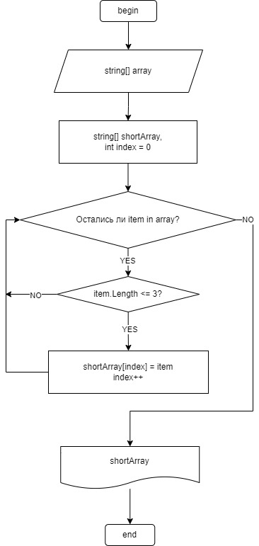

# Итоговая контрольная работа по основному блоку

*Задание:*

```
Написать программу, которая из имеющегося массива строк формирует новый 
массив из строк, длина которых меньше, либо равна 3 символам. 
Первоначальный массив можно ввести с клавиатуры, либо задать на старте 
выполнения алгоритма. При решении не рекомендуется пользоваться 
коллекциями, лучше обойтись исключительно массивами.
```

------------------

*Решение:*

[Файл с исходным кодом](Program.cs)

## Методы

Заполняет массив строками с длиной от 1 до 10 символов (определяется случайно), со случайными символами с 48 по 127 символы таблицы ASCII

```cs
void FillRandomArray(string[] array)
{
  Random rnd = new Random();
  int elementLength;
  char simbol;
  string tempString;

  for (int i = 0; i < array.Length; i++)
  {
    elementLength = rnd.Next(1, 10);
    tempString = "";
    for (int j = 0; j < elementLength; j++)
    {
      simbol = Convert.ToChar(rnd.Next(48, 127));
      tempString += simbol;
    }
    array[i] = tempString;
  }
}
```

Выводит массив в консоль, элементы массива разделяются табуляцией

```cs
void PrintArray(string[] array)
{
  foreach (var item in array)
  {
    System.Console.Write($"{item}\t");
  }
  System.Console.WriteLine();
}
```

Возвращает массив фиксированной длины (указывается пользователем), заполненный случайными строками  
```cs
string[] CreateRandomArray()
{
  int length = new int();
  while (true)
  {
    System.Console.Write("Для создания случайного массива введите количество элементов: ");
    bool success = int.TryParse(Console.ReadLine(), out length);
    if (success == true)
    {
      break;
    }
    else
    {
      System.Console.WriteLine("Ошибка данных. Нужно ввести целочисленное значение!");
    }
  }
  string[] array = new string[length];
  FillRandomArray(array);
  return array;
}
```

Возвращает количество элементов массива со строками меньше или равно 3 символам (для определения количества элементов искомого массива)
```cs
int GetLengthShortArray(string[] array)
{
  int arrayLength = 0;
  foreach (var item in array)
  {
    if (item.Length <= 3)
    { arrayLength++; }
  }
  return arrayLength;
}
```

Возвращает массив заполненный строками с длиной меньше или равно 3 символам
```cs
string[] GetShortStrings(string[] array)
{
  int index = 0;
  string[] shortArray = new string[GetLengthShortArray(array)];
  foreach (var item in array)
  {
    if (item.Length <= 3)
    {
      shortArray[index] = item;
      index++;
    }
  }
  return shortArray;
}
```
Возвращает массив введенный вручную из консоли
```cs
string[] FillArrayManually()
{
  System.Console.Write("Введите массив, разделяя элементы пробелами: ");
  string inputString = Console.ReadLine();
  string[] array = inputString.Split(" ");
  return array;
}
```

Реализованы 2 способа задания первоначального массива:

- случайным образом
- введение вручную из консоли (элементы разделяются пробелом)

Также для возможности работы консоли с символами Русского алфавита, изменены кодировки на UNICODE

```cs
Console.InputEncoding = Encoding.Unicode;
Console.OutputEncoding = Encoding.Unicode;
```

Блок-схема основного метода GetShortStrings:

